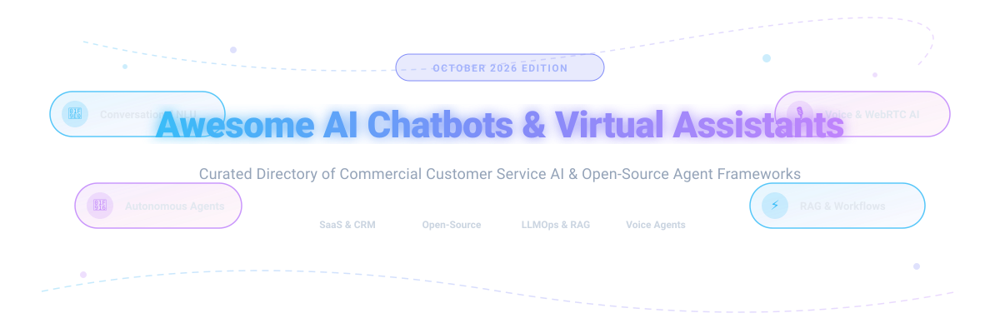

# Awesome-AI-Chatbots-Virtual-Assistants 🤖 💬

  

  
  
  
  
  

---

## 🌟 Top AI Chatbots & Virtual Assistants Ecosystem 🚀

**Curated List of Commercial Conversational AI Platforms & Open-Source Chatbot Frameworks** 🤖  
*Focused on Customer Service Automation 💡, Virtual Agents 👩‍💼, Conversational NLU 🧠, Multi-Channel Deployment 📱, LLM-Powered Assistants ⚡, Self-Hosted Chatbot Platforms 🏛️, Voice Bots 🎙️, and Multi-Agent Orchestration ⚙️*

**Last updated: October 2026** 📅

---

### 📌 Overview & SEO Summary 🔍
Welcome to the ultimate curated directory of **AI chatbots** 💬, **virtual assistant platforms** 🤖, **open-source conversational AI frameworks** 🔓, **voice AI agents** 🎙️, and **customer service automation software** ⚡. Whether you are evaluating enterprise-grade commercial platforms (such as *Salesforce Einstein Bots*, *Intercom Fin*, *Ada*, and *Cognigy.AI*), or self-hostable open-source solutions (like *Dify*, *Langflow*, *Flowise*, *Rasa*, *Botpress*, *Pipecat*, and *LiveKit Agents*), this guide covers category leaders, conversational NLU engines, RAG orchestration, and privacy-focused digital assistant infrastructure. 🛍️

---

## 📑 Table of Contents 📜
- [📊 Market Landscape & Industry Dynamics](#-market-landscape--industry-dynamics) 📈
- [🏢 SaaS & Commercial Platforms](#-saas--commercial-platforms) 💼
- [🔓 Open-Source GitHub Projects](#-open-source-github-projects) 🌟
- [🛠️ How to Contribute](#%EF%B8%8F-how-to-contribute) 🤝
- [🤝 Support & Sponsorship](#-support--sponsorship) ❤️
- [⚠️ Disclaimer](#%EF%B8%8F-disclaimer) ℹ️
- [📊 Star History](#-star-history) ⭐

---

## 📊 Market Landscape & Industry Dynamics 📈

> 📈 **Market Size & Structure Analysis (2026):** 🌐
> The global **Conversational AI & Virtual Assistant Market** is estimated at **~$17.5 Billion to $18.0 Billion in 2026** and is projected to reach **~$41.4 Billion by 2030** at a **Compound Annual Growth Rate (CAGR) of ~23.5%**. 🚀
> 
> The market is currently **highly fragmented** 🧩, driven by rapid open-source innovations in LLMs, agentic workflows, and voice models. While tech giants (Salesforce, Microsoft, NICE) hold major enterprise market share in CRM and contact centers, specialized vendors (Intercom, Ada, Voiceflow) and open-source frameworks (Dify, Langflow, Rasa) capture significant growth across niche customer service, developer ecosystem, and voice automation sectors. ⚙️

---

## 🏢 SaaS / Commercial Platforms 🏢

The commercial conversational AI sector features enterprise CRM-integrated systems ☁️, AI-native customer experience platforms with outcome-based pricing 💬, and low-code voice and chat bot builders 🎙️. Below is a comprehensive breakdown sorted by company valuation / market cap in descending order:

| SaaS / Commercial Platform | Company / Owner | Valuation / Market Cap | Standard Edition Starting Price | Free Tier / Free Trial Limits | Description |
| :--- | :--- | :--- | :--- | :--- | :--- |
| **[Salesforce Einstein Bots](https://www.salesforce.com/products/customer-service-chatbot/)** ☁️ | Salesforce | **~$250.0 Billion** (Public Market Cap) | **$75/user/month** (Digital Engagement add-on) | **Included in Service Cloud Unlimited Edition** (30-day free trial available) | **CRM-integrated chatbot platform** — Rule-based and intent bots integrated into Salesforce CRM. Plan future deployment around Agentforce. 💼 |
| **[Cognigy.AI](https://www.cognigy.com/)** 🧠 | NICE (Acquired) | **~$10.0 Billion** (Parent Market Cap) | **$500/month** (Starter tier estimate) | **14-day full feature free trial** (No credit card required) | **Contact-center conversational AI** — Enterprise-grade low-code conversational AI and agentic automation for voice and digital customer service. 🎧 |
| **[Amelia](https://www.amelia.com/)** 👩‍💼 | SoundHound AI (Acquired) | **~$2.5 Billion** (Parent Market Cap) | **$1,000/month** (Base platform tier) | **14-day customized demo trial** | **Cognitive virtual agent** — Enterprise conversational AI platform for voice & digital agents with deep enterprise integrations. 🏢 |
| **[Drift](https://www.drift.com/)** 🚗 | Salesloft / Vista Equity | **~$2.3 Billion** (Acquisition Valuation) | **$2,500/month** (Premium tier billed annually) | **14-day trial** (Self-serve demo access) | **Conversational marketing platform** — AI chatbots optimized for B2B lead generation, buyer intent routing, and real-time sales meetings. 🎯 |
| **[Intercom Fin](https://www.intercom.com/)** 💬 | Intercom | **~$1.3 Billion** (Private Valuation) | **$0.99 per resolution outcome** + **$29/seat/month** | **14-day free trial** (Includes 50 free Fin AI resolutions) | **AI-first customer service platform** — Autonomous resolution engine that charges per verified resolution outcome with zero seat cost for AI. ⚡ |
| **[Yellow.ai](https://yellow.ai/)** 💛 | Yellow.ai | **~$500 Million** (Private Valuation) | **$99/month** (Growth Plan) | **21-day free trial** (Includes 100 free bot conversations) | **Multi-channel CX automation** — Dynamic AI agent platform supporting 35+ channels with multi-LLM orchestrator capabilities. 🌐 |
| **[Ada](https://www.ada.cx/)** 🟢 | Ada | **~$1.2 Billion** (Private Valuation) | **$30,000/year** (AWS Marketplace Base Contract) | **No self-serve free trial** (14-day interactive guided demo access) | **Enterprise CX automation** — Resolution-based AI platform featuring automated playbooks, LLM coaching, and enterprise governance. 🛡️ |
| **[Voiceflow](https://www.voiceflow.com/)** 🎨 | Voiceflow | **~$105 Million** (Private Valuation) | **$60/month** (Pro Plan per editor seat) | **Free Forever Plan** (Includes 100 total lifetime credits for prototyping) | **Conversational AI design platform** — Collaborative visual builder for designing, prototyping, and launching chat and voice assistants. ✨ |
| **[Kore.ai](https://kore.ai/)** 🎯 | Kore.ai | **~$1.0 Billion** (Private Valuation) | **$100 reload minimum** (Pay-as-you-go consumption) | **Free Forever Tier: 5,000 sessions** (Account lifetime credit allocation) | **Enterprise conversational AI** — Robust platform with pre-built domain bots, multi-LLM orchestration, and enterprise security controls. 🔒 |
| **[Botpress Cloud](https://botpress.com/)** 🟣 | Botpress | **~$100 Million** (Private Valuation) | **$89/month** (Plus Tier) | **Free Forever Tier: 2,000 message credits/month** + 3 bot slots | **Visual chatbot & agent builder** — Next-gen AI bot platform with visual workflow editor, Autonomous Knowledge Base, and multi-channel connectors. 🔮 |
| **[Tidio Lyro](https://www.tidio.com/)** ⚡ | Tidio | **~$50 Million** (Private Valuation) | **$39/month** (Lyro AI add-on for 50 conversations) | **Free Plan: 50 one-time Lyro AI conversations** + 50 live chat chats/month | **Ecommerce AI chatbot platform** — AI support bot tailored for Shopify/WooCommerce store automation with live chat handoff. 🛍️ |

---

## 🔓 Open-Source GitHub Projects 🔓

*Sorted by GitHub Stars Count (Descending)* 🌟

- **[Dify](https://github.com/langgenius/dify)**   
  **Open-source LLMOps & Agentic Workflow Platform**, Apache-2.0 licensed. **157K+ GitHub stars** — Visual workflow builder, built-in RAG pipelines, prompt orchestration, and 100+ LLM provider integrations. 🎨

- **[Langflow](https://github.com/langflow-ai/langflow)**   
  **Visual Framework for Multi-Agent & RAG Applications**, MIT licensed. **155K+ GitHub stars** — Highly accessible drag-and-drop component builder for Python LLM applications and conversational agents. 🎯

- **[Flowise](https://github.com/FlowiseAI/Flowise)**   
  **Drag & Drop UI to Build LLM Apps**, MIT licensed. **55.5K+ GitHub stars** — Node.js-based visual builder for customizing LangChain pipelines, chatbot widgets, and vector search. ⚡

- **[Rasa](https://github.com/RasaHQ/rasa)**   
  **Enterprise Open-Source Conversational AI Framework**, Apache-2.0 licensed. **30M+ downloads** — Infrastructure for building contextual assistants with Rasa CALM (Conversational AI with LLMs), business flows, and full on-premises data control. 🏛️

- **[Botpress v12](https://github.com/botpress/botpress)**   
  **Open-Source Modular Chatbot Engine**, AGPL-3.0 licensed. **11.5K+ GitHub stars** — Developer-first conversational framework featuring built-in NLU, visual flow manager, and broad channel messaging support. 🎨

- **[Pipecat](https://github.com/pipecat-ai/pipecat)**   
  **Open-Source Framework for Voice & Multimodal AI Agents**, MIT licensed. **16.3K+ GitHub stars** — Real-time audio processing pipeline for building ultra-low latency voice chatbots, webRTC assistants, and phone agents. 🎙️

- **[LiveKit Agents](https://github.com/livekit/agents)**   
  **Real-Time Multimodal Voice & Video Agent Framework**, Apache-2.0 licensed. **14.6K+ GitHub stars** — Programmable infrastructure for building real-time voice and vision digital human assistants powered by WebRTC. 📹

- **[Microsoft Bot Framework SDK](https://github.com/microsoft/botframework-sdk)**   
  **Enterprise SDK for Building Conversational Bots**, MIT licensed. **Bot Builder SDK for C#, Node.js, and Python** with direct connectors for Microsoft Teams, Web Chat, and Azure Bot Service. 🏢

- **[EDDI](https://github.com/labsai/EDDI)**   
  **Enterprise Prompt & Conversation Middleware**, Apache-2.0 licensed. Lean Java/Quarkus-based orchestration engine for OpenAI, Gemini, Anthropic, and local LLMs. 🛠️

- **[Kairon](https://github.com/digiteinfotech/kairon)**   
  **Web-based No-Code Conversational AI Platform**, Apache-2.0 licensed. Microservices architecture for training and deploying Rasa-powered virtual assistants with pre-built connectors. 🎯

- **[JAICF](https://github.com/just-ai/jaicf-kotlin)**   
  **Kotlin Framework for Conversational Voice Assistants**, Apache-2.0 licensed. Comprehensive JVM framework for building dialogue systems across Alexa, Google Assistant, and chat apps. 🎙️

- **[AVA](https://github.com/0x77dev/ava)**   
  **Self-Hosted Personal AI Assistant**, MIT licensed. Privacy-focused assistant integrated with Home Assistant, local LLMs, and smart home automation systems. 🏠

- **[Eva](https://github.com/edouardpoitras/eva)**   
  **Voice-Enabled Personal Assistant Platform**, MIT licensed. Modular assistant system designed for custom voice control and IoT device management. 🎙️

- **[BUD-E](https://github.com/LAION-AI/Desktop_BUD-E)**   
  **Open-Source Desktop Voice AI Assistant**, Apache-2.0 licensed. Natural voice agent by LAION AI designed for continuous conversation, screen awareness, and local model inference. 🧪

- **[Convo](https://github.com/AshutoshDongare/convo)**   
  **Voice Bot Framework for Humanoid Robotics**, MIT licensed. Real-time spoken dialogue engine optimized for virtual avatars and robotic agents. 🤖

- **[WAssist](https://github.com/t0mer/WAssist)**   
  **WhatsApp AI Assistant with Memory**, MIT licensed. Personal assistant integration for WhatsApp with persistent vector storage and LLM retrieval. 📱

---

## 🛠️ How to Contribute 🛠️

Contributions are welcome! Follow these steps to submit new AI chatbot platforms or open-source conversational AI software: 💡

1. 🍴 **Fork** the repository.
2. 📝 **Add/edit** entries in `README.md` maintaining table/list structure and formatting.
3. 🔗 Include project title, official website/GitHub link, exact Stars_Count, license, and brief description.
4. 🚀 Submit a **Pull Request** with a descriptive summary of your changes.

---

## 🤝 Support & Sponsorship 🤝

Thank you for visiting this repository! If you find this curated directory of AI chatbots, virtual assistants, and conversational frameworks helpful:

- ⭐ **Star** this repository to show your appreciation and help others discover it!
- 🔀 **Fork** and share with your team, fellow AI engineers, and community.
- ☕ **Sponsor & Buy Me a Coffee**: If you would like to support ongoing research and curation, you can contribute via the [GitHub Sponsor Dashboard](https://github.com/sponsors/ishandutta2007).

---

## ⚠️ Disclaimer ⚠️

- This is a **community-curated** list — not exhaustive and not an endorsement. ℹ️
- **Einstein Bots remains supported** but Salesforce's investment is focused on **Agentforce** — plan roadmap accordingly. **Ada is enterprise-only** with base contracts starting around **$30,000/year**. 💼
- **Kore.ai offers 5,000 free lifetime sessions**, while **Tidio Lyro provides 50 trial conversations**. ⚡
- **Open-source conversational AI frameworks require setup** — Rasa requires NLU expertise, Dify/Langflow/Flowise require LLM keys/hosting, and Pipecat/LiveKit require audio streaming setups. **Always validate security and privacy** before production deployment. 🤖

---

## 📊 Star History

---

  <b>Made with ❤️ for AI engineers, customer service leaders, and open-source conversational AI advocates.</b>

